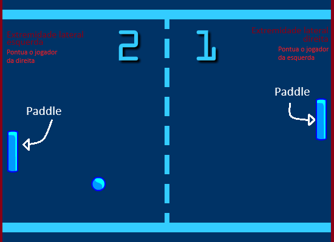

# Trabalho Final de Desenvolvimento de Games

Trabalho Desenvolvido para entrega final da materia de Desenvolvimento de Games.

## Sobre

Foi escolhido para esse projeto o a biblioteca Phaser.js

Para rodar o jogo localmente - necessário um server próprio.  
Sugestão - usar o *http-server*:

1. Instalar:  
    ```npm install -g http-server```
2. Executar o servidor:  
    ```http-server -c-1```

## Descrição do Jogo

Jogo escolhido: PONG

O Pong é um jogo de arcade clássico. 
Dois jogadores controlam paddles para rebater uma bola de um lado para o outro.  
A pontuação é marcada quando a bola ultrapassa o paddle do oponente.  
Se a bola atinge as extremidades laterais da tela, o adversário pontua.  
O primeiro a atingir uma pontuação predeterminada vence.  



<!-- incentivando a agilidade e estratégia na defesa e ataque -->
O jogo promove partidas rápidas e intensas, clássico e icônico desde a era dos arcades.

<!---
Esse Arquivo deverá ser convertido para se tornar o README.md principal quando for entregue ao professor
-->
# Como jogar 

## Definição

Dois jogadores controlam raquetes para rebater uma bola e marcar pontos. Este manual fornecerá instruções sobre como jogar, os controles e algumas informações sobre a implementação do código.

## Objetivo

Marcar mais pontos do que o adversário. Os jogadores ganham pontos quando a bola ultrapassa a raquete do oponente.

## Controles

- **Player 1 (Esquerda):** A raquete esquerda é controlada automaticamente pela inteligência artificial e tenta acompanhar a posição da bola.
  
- **Player 2 (Direita):** Use as setas do teclado para cima e para baixo para mover a raquete para cima e para baixo, respectivamente.

## Regras

- A bola rebaterá nas paredes superior e inferior da tela, bem como nas raquetes dos jogadores.
- Cada vez que a bola ultrapassar a raquete do oponente, o jogador adversário ganhará um ponto.
- O primeiro jogador a atingir a pontuação de 5, 10, 15, e assim por diante, ganha o jogo.
- O jogo pausará e reproduzirá um som de vitória quando um jogador vencer.

